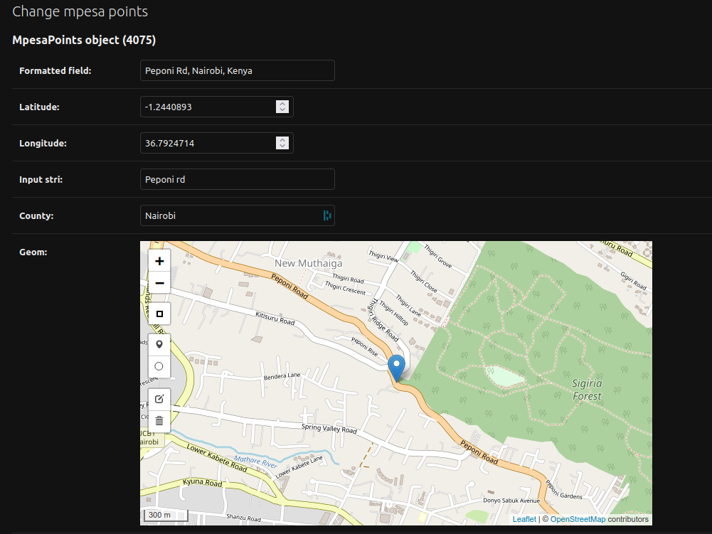

= Data Directory

The general folder structure for the project can be seen below:

----
├── load_data.py          # Script for loading data using GeoDjango LayerMapping utility
├── mpesa_locations.gpkg  # GeoPackage file containing MPESA locations
├── README.md             # Current readme file

----

This directory contains geospatial data for MPESA retailers' location within the counties of link:https://en.wikipedia.org/wiki/Nairobi[Nairobi], link:https://en.wikipedia.org/wiki/Kiambu_County[Kiambu] and link:https://en.wikipedia.org/wiki/Machakos_County[Machakos] in link:https://en.wikipedia.org/wiki/Kenya[Kenya]. The data was obtained from Google Maps via its geo-location Application Programming Interface (API), filtered and edited in link:https://www.osgeo.org/projects/qgis/[QGIS Desktop], an open-source GIS desktop software and saved in the link:https://www.geopackage.org/[GeoPackage] format.

== Appearance in the Backend

== Appearance in the Frontend